# GVE DevNet Webex Recordings to AWS

Cisco Webex is THE unified app for the future of work, where you can call, meet, collaborate and message. Webex allows you to record meetings if needed and the Webex cloud stores recordings by default up to one year with a maximum of 10 years possible. However, some customers are required by law to store recordings for a longer period of time. One solution would be to migrate the recordings to the AWS cloud. 

By using the Webex and AWS API, we have created a Flask application that integrates the two solutions and allows the user to migrate recordings from the Webex cloud to the AWS cloud. We can migrate the recordings in three simple steps:

0. First, we have to login and obtain our Webex access token:

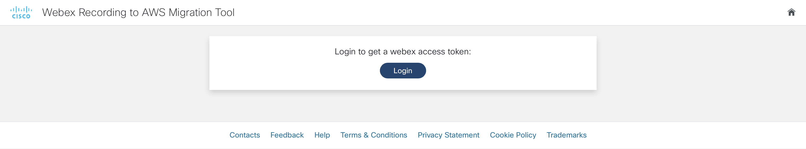

1. After having logged in and authorized the application, we should select the `siteUrl` and the period that we are interested in:

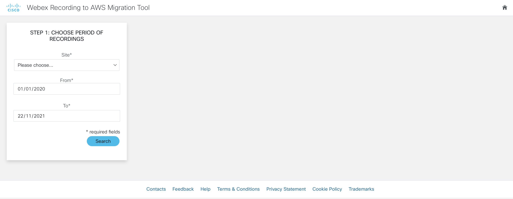

2. Then, we will obtain a table of all the recordings that are available and it will be immediately indicated if the Webex recording has been migrated to the cloud or not: 

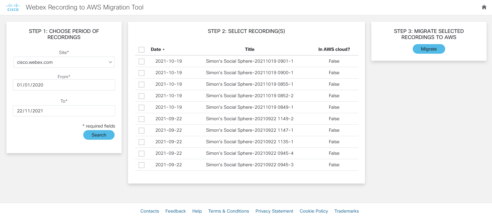

3. When you have selected the recordings that you would like to migrate, you can press the button `Migrate` to start the migration process:


4. After the migration process, we will get a summary of the recordings that have been migrated. Moreover, the table has been updated to reflect the changes: 

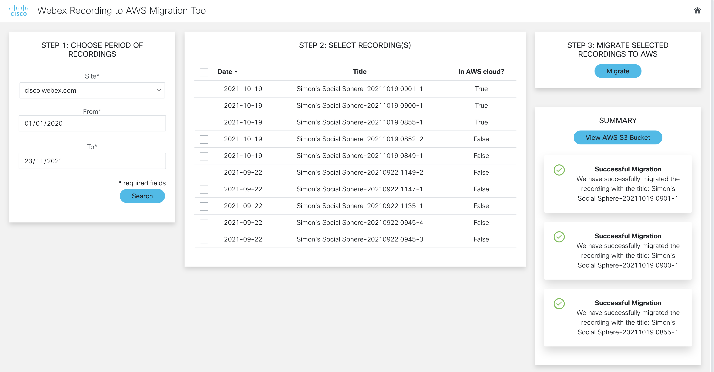


## Contacts
* Simon Fang (sifang@cisco.com)
* Stien Vanderhallen (stienvan@cisco.com)

## Solution Components
* Python
* Flask
* Webex
* AWS

## Prerequisites
* Webex OAuth Integration
* AWS S3 Storage
* Webex Account

## How to register your own Webex OAuth integration
Registering an integration with Webex is easy and can be done in a couple of steps. If you have already registered your Webex OAuth integration with the right scopes, then you can skip this step.

1. First, head over to developer.webex.com and log in:


2. After having logged in, click on your avatar and select `My Webex Apps` from the menu under your avatar. 

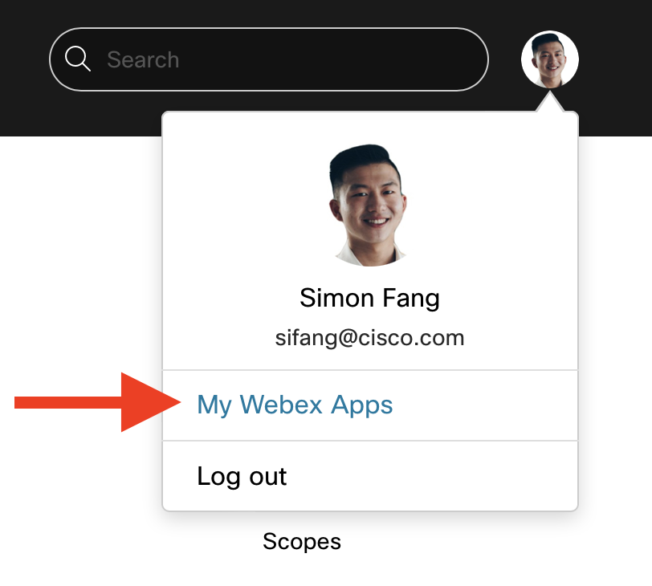

3. On the new page, click `Create a New App` in the top right corner:

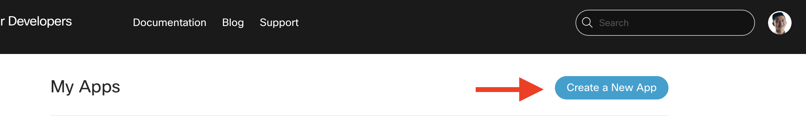

4. Then, click `Create an Integration` to start the wizard: 

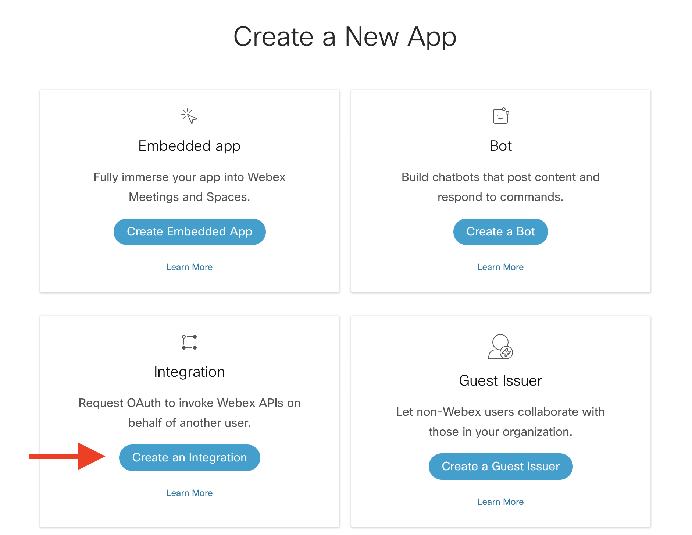

5. In the wizard, fill in the form fields:

    * **Name:** The name of the app, e.g. My Webex Integration
    * **Icon:**: Choose an icon or upload an icon
    * **Description:** Explain what your integration can do. Note that these details are not displayed to the end-users of the integration
    * **Redirect URI(s):** Important! The Redirect URI has to match with the `webex_integration_redirect_uri` in the `env_var.py` file. In our case, this will be `"http://127.0.0.1:5000/webexoauth"`
    * **Scopes:** We have to define the level of access that our integration requires. For our app, we require the following scopes: 

        * `meeting:preferences_read` 
        * `meeting:recordings_read`
        * `meeting:admin_recordings_read` 
        * `spark-compliance:meetings_write` 
        * `spark:all`

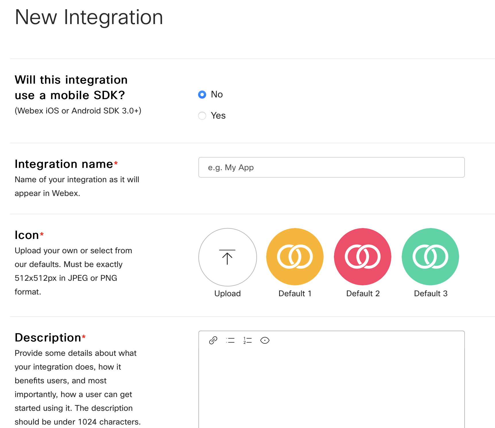

6. After having filled in the details, click on `Add integration` and you will be taken to the next page, where you will be given the `Client ID` and `Client Secret` along with the OAuth Authorization URL. It is important to copy and store the `Client Secret` in a safe place as it will be generated and displayed only once for security purposes. In case you lose it, then a new client secret will be regenerated: 

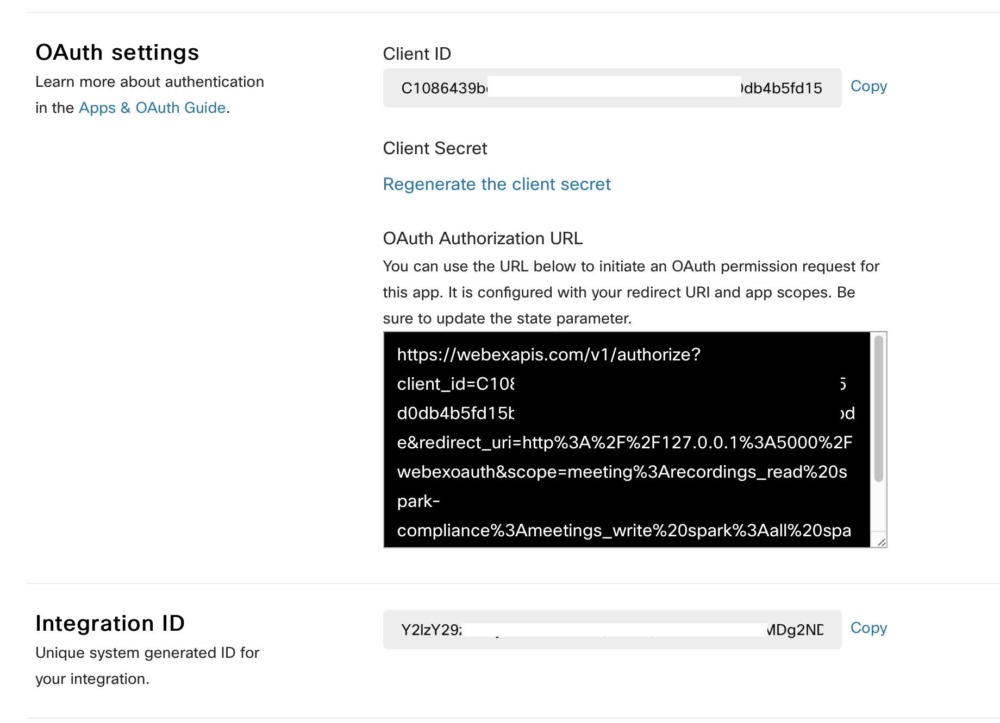

> Note: the documentation for Webex integrations can be found [here](https://developer.webex.com/docs/integrations)

## AWS S3 Storage
Next, we have to create AWS S3 storage, where we are going to migrate the Webex recordings to. In case you have already set up S3 storage and obtained the API credentials, then you can skip this step. 

1. Sign in to the AWS Management Console and open the Amazon S3 console at https://console.aws.amazon.com/s3/. 

2. Choose **Create bucket** and the wizard opens to guide you through. 

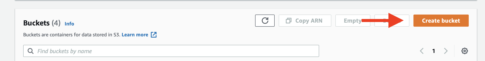

3. Choose a **Bucket name** that is DNS-compliant. The bucket name must be:

    * Be unique across all of Amazon S3
    * Be between 3 and 63 characters long
    * Only lowercase letters
    * Start with a lowercase letter or number

4. Choose the **AWS Region**. The closer the region, the lower the latency. Take a note of both the **Bucket name** and **AWS Region**, which will have to be stored in our environment variables. 

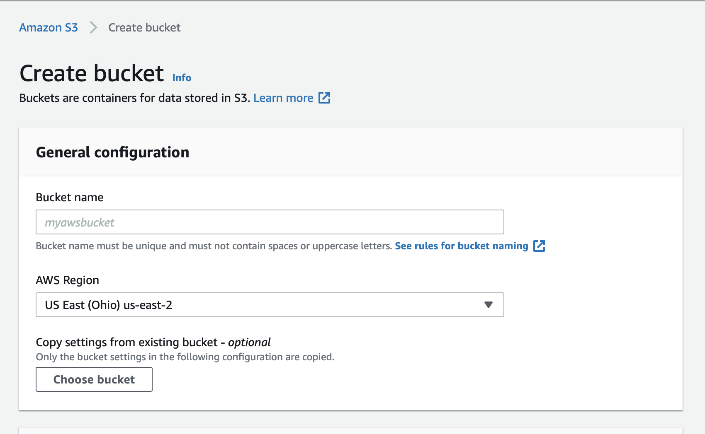

5. All other options may remain enabled in its default values. Finalize the process by choosing **Create bucket**. 

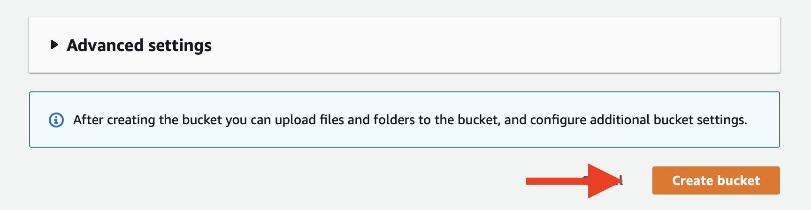

> Note: the instructions on how to create a bucket in S3 storage can be found [here](https://docs.aws.amazon.com/AmazonS3/latest/userguide/create-bucket-overview.html)

6. After having successfully created a bucket in S3 Storage, we have to create a set of access keys for API access. Log in to the AWS Management Console and head over to the IAM console: https://console.aws.amazon.com/iamv2/home

7. Click on **Users** and then **Add users**

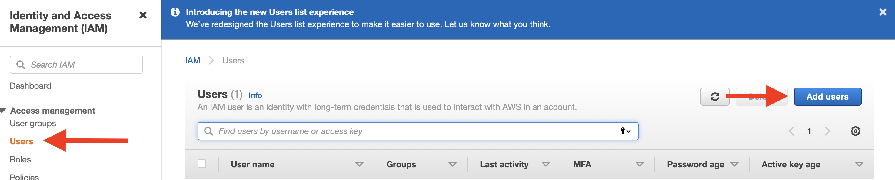

8. In the wizard, select a **User name** and select **Access key - Programmatic access** for the AWS access type. 

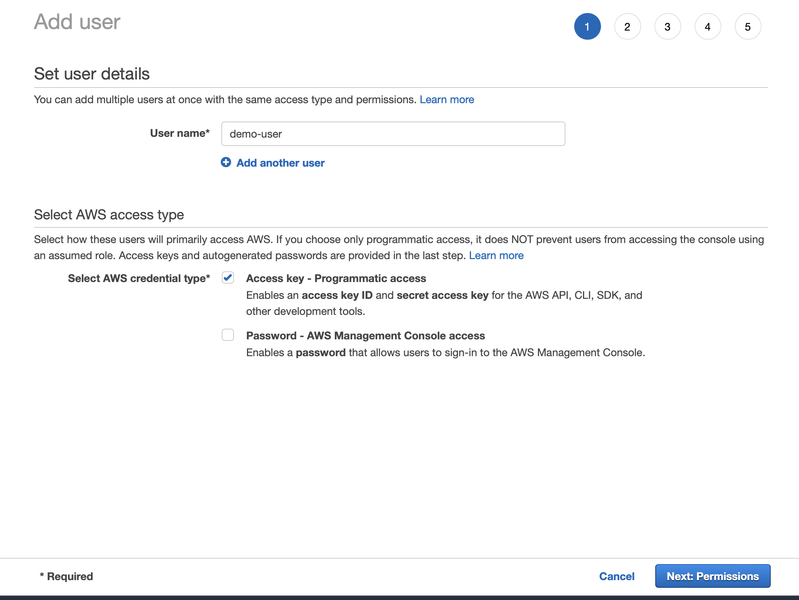

9. In the next step, grant the permissions and optionally add tags. 

10. In the last step, review all the changes and confirm. Then, you will be shown the **Acces key ID** and the **Secret access key**. Store the set of keys in a safe place and add them later into our environment variables. 

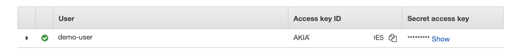

> Note: the instructions on how to obtain _programmatic access keys_ in AWS can be found [here](https://docs.aws.amazon.com/general/latest/gr/aws-sec-cred-types.html)

## Installation/Configuration

The following commands are executed in the terminal.

1. Create and activate a virtual environment for the project:
   
        #WINDOWS:
        $ py -3 -m venv [add_name_of_virtual_environment_here] 
        $ [add_name_of_virtual_environment_here]/Scripts/activate.bat
        #MAC:
        $ python3 -m venv [add_name_of_virtual_environment_here] 
        $ source [add_name_of_virtual_environment_here]/bin/activate
        
> For more information about virtual environments, please click [here](https://docs.python.org/3/tutorial/venv.html)

2. Access the created virtual environment folder

        $ cd [add_name_of_virtual_environment_here]

3. Clone this repository

        $ git clone [add_link_to_repository_here]

4. Access the folder `GVE_DevNet_Webex_Recordings_to_AWS`

        $ cd GVE_DevNet_Webex_Recordings_to_AWS

5. Install the dependencies:

        $ pip install -r requirements.txt

6. Open the `env_var.py` file and add the environment variables. In the sections above, it is explained how to obtain these credentials and variables. Please note that all the variables below are strings.

    ```python
    # Webex integration credentials
    webex_integration_client_id = "<insert_webex_integration_client_id>"
    webex_integration_client_secret= "<insertwebex_integration_client_secret>"
    webex_integration_redirect_uri = "http://127.0.0.1:5000/webexoauth"
    webex_integration_scope = "meeting:preferences_read meeting:recordings_read meeting:admin_recordings_read spark-compliance:meetings_write spark:all"

    # AWS Variables
    AWS_ACCESS_KEY_ID = "<insert_AWS_ACCESS_KEY_ID>"
    AWS_SECRET_ACCESS_KEY = "<insert_AWS_SECRET_ACCESS_KEY>"
    REGION_NAME = "<insert_REGION_NAME>"
    BUCKET_NAME = "<insert_BUCKET_NAME>"
    ```

## Usage
Now it is time to launch the application! Simply type in the following command in your terminal:

    $ python app.py

Then, head over to the URL that is displayed in the terminal output. 


# Screenshots


### LICENSE

Provided under Cisco Sample Code License, for details see [LICENSE](LICENSE.md)

### CODE_OF_CONDUCT

Our code of conduct is available [here](CODE_OF_CONDUCT.md)

### CONTRIBUTING

See our contributing guidelines [here](CONTRIBUTING.md)

#### DISCLAIMER:
<b>Please note:</b> This script is meant for demo purposes only. All tools/ scripts in this repo are released for use "AS IS" without any warranties of any kind, including, but not limited to their installation, use, or performance. Any use of these scripts and tools is at your own risk. There is no guarantee that they have been through thorough testing in a comparable environment and we are not responsible for any damage or data loss incurred with their use.
You are responsible for reviewing and testing any scripts you run thoroughly before use in any non-testing environment.
